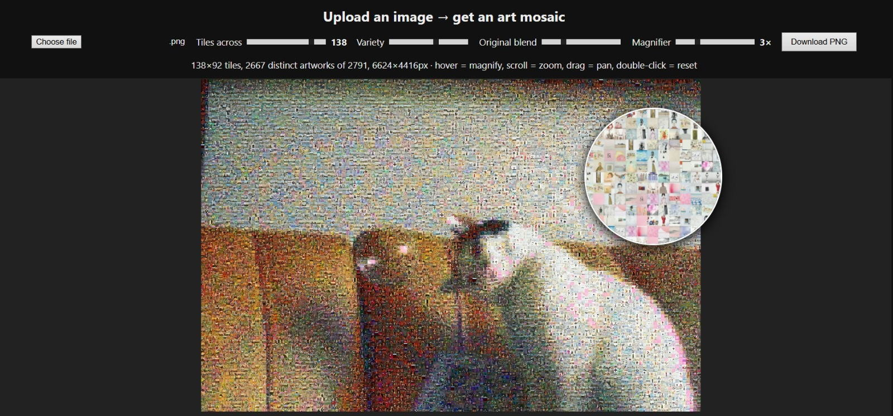

# Google Arts & Culture Color Dataset & Mosaic Generator

**(DISCLAIMER!!!!!! SOME OF THE PAINTINGS ARE NO IN PUBLIC DOMAIN. EDUCATIONAL PURPOSES!!!!!!)**

A toolkit that scrapes artworks grouped by color from Google Arts & Culture, organizes them into labeled colour datasets with numeric values, and packages them into a browser-based photomosaic generator that runs entirely offline.



## Contents

- [Features](#features)
- [Project Structure](#project-structure)
- [Quick Start](#quick-start)
- [Using the Mosaic App](#using-the-mosaic-app)
- [Building the Pipeline](#building-the-pipeline)
- [Datasets](#datasets)
- [Testing](#testing)
- [Documentation](#documentation)

## Features

**Color datasets**
- 10 color categories: White, Gray, Pink, Purple, Blue, Teal, Green, Yellow, Orange, and Red
- Each category carries a custom numeric value for use in machine learning training
- A merged `all_colors.csv` covers every category in one file

**Photomosaic app**
- Runs as a single HTML file in any modern browser, with no server or installation
- Upload your own image and build a mosaic from the bundled tile atlas (2,791 tiles)
- Control grid density from 20 to 160 tiles across
- Adjust tile variety so repeated tiles are reduced or allowed
- Blend the original image into the mosaic for stronger recognition
- Zoom with the mouse wheel and pan by dragging
- Inspect details with a hover magnifier, where magnification strength is adjustable
- Download the finished mosaic as a full-resolution PNG

## Project Structure

```text
google-arts-color-mosaic/
├── datasets/              # Color datasets: images and CSV metadata
│   ├── WHITE/ … RED/      # One folder per color (10 total)
│   └── all_colors.csv     # Merged metadata across all colors
├── mosaic/
│   ├── index.html         # Standalone mosaic creator
│   ├── atlas.js           # Base64-encoded sprite atlas (2,791 tiles)
│   ├── sample_output.png  # Example rendered mosaic
│   └── sample_magnifier.png  # Example hover magnifier view
├── scraper.py             # Scrapes Google Arts & Culture by color
├── build_mosaic.py        # Compiles dataset images into mosaic/atlas.js
├── validate.py            # Validates and normalizes the datasets
├── summarize.py           # Trims datasets offline and reports counts
├── test_mosaic.py         # Automated tests for the mosaic viewer
├── plan.md                # Technical specification and color value map
└── progress.md            # Implementation log
```

## Quick Start

1. Clone or download this repository.
2. Open `mosaic/index.html` in a modern web browser (Chrome, Firefox, Safari, or Edge).
3. Upload an image and adjust the settings.

No web server or build step is required for the mosaic app.

## Using the Mosaic App

1. **Upload** a source image using the upload control.
2. **Set the grid** to choose how many tiles span the width. More tiles give more detail but take longer to render.
3. **Set variety** to limit how often the same tile repeats.
4. **Adjust blending** to mix the original image into the tiles. This keeps the subject recognizable.
5. **Explore** the result with the mouse wheel to zoom, drag to pan, and hover to open the magnifier.
6. **Download** the full-resolution PNG when you're satisfied.

## Building the Pipeline

The scripts run in this order:

```bash
python scraper.py          # 1. Collect images and metadata by color
python validate.py         # 2. Check and normalize the datasets
python summarize.py        # 3. Optionally trim datasets and print counts
python build_mosaic.py     # 4. Rebuild mosaic/atlas.js from the datasets
python test_mosaic.py      # 5. Run the mosaic test suite
```

Rebuild `atlas.js` whenever the datasets change. The mosaic app reads only that file, so it will not reflect dataset edits until you run `build_mosaic.py` again.

## Datasets

Each color folder contains its images, and `all_colors.csv` lists every artwork with its color label and numeric value. See `plan.md` for the full color value map and the rules used to assign values.

## Testing

```bash
python test_mosaic.py
```

The suite checks the mosaic viewer's behavior. Run it after changing `index.html` or `atlas.js`.

## Documentation

- `plan.md` covers the technical specification and color value map.
- `progress.md` logs each implementation step.

## Notes

Scraping Google Arts & Culture is subject to that site's terms of service. Check them before running `scraper.py` at scale, and respect any rate limits. Verify the artwork images' licenses before redistributing the datasets or any mosaics built from them.
